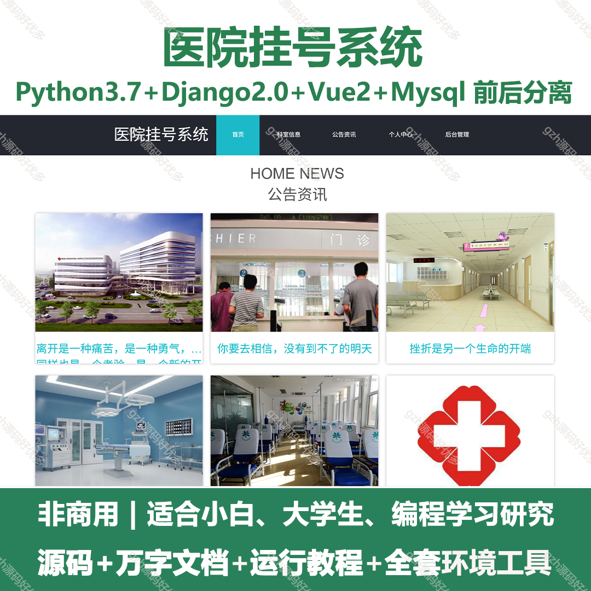
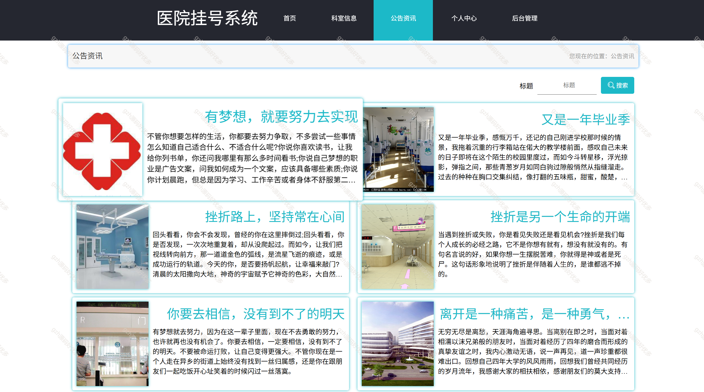
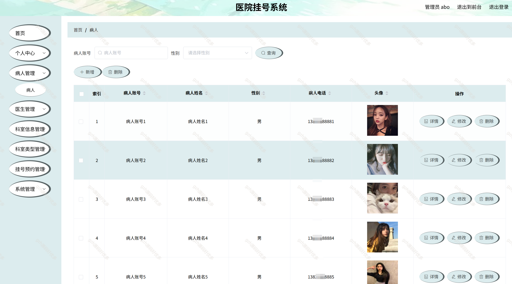
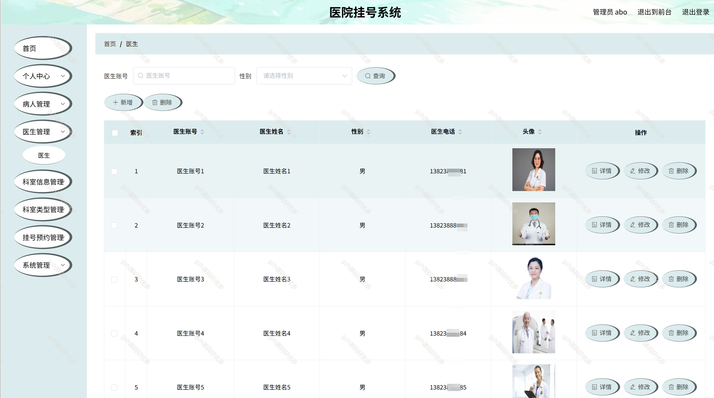
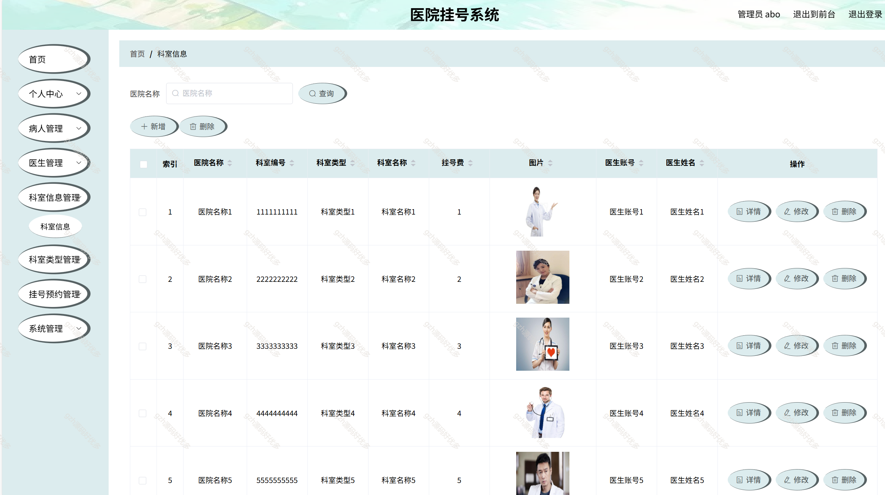
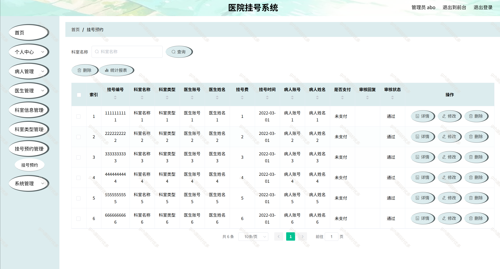
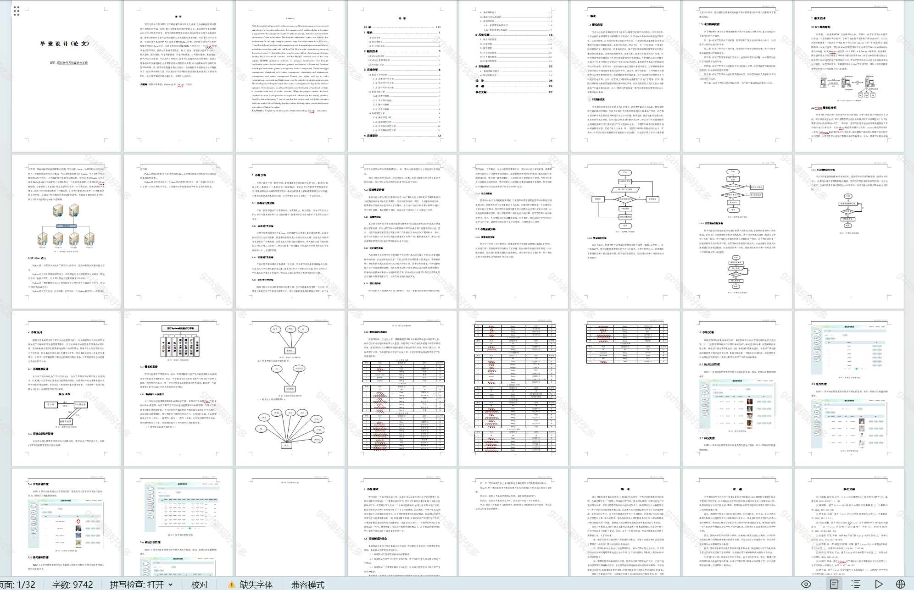

# python050
python050基于Python+Django的医院挂号系统
 
## 查看主页获取源码

### 一、关键词
医院系统，医院挂号系统

### 二、作品包含
源码+数据库+设计文档+全套环境和工具资源+部署教程

### 三、项目技术
前端技术：Vue2.0、Element-ui、Layui
后端技术：Python3.7、Django2.0

### 四、运行环境（以下版本亲测，其他版本兼容性请自行测试）
开发工具：PyCharm + VSCODE

数据库：MySQL5.7（最低要5.7版本）

数据库管理工具：Navicat10+

Python：Python3.7

前端Nodejs：14

浏览器：谷歌浏览器

### 五、项目介绍
项目编号：python050

本医院挂号系统就是在这样的大环境下诞生，其可以帮助管理者在短时间内处理完毕庞大的数据信息，使用这种软件工具可以帮助管理人员提高事务处理效率，达到事半功倍的效果。

医院挂号系统有管理员，病人，医生。管理员功能有个人中心，病人管理，医生管理，科室类型管理，科室信息管理，挂号预约管理，系统管理。病人可以注册登录，可以进行挂号预约，医生可以查看病人的挂号预约。

### 六、运行截图

